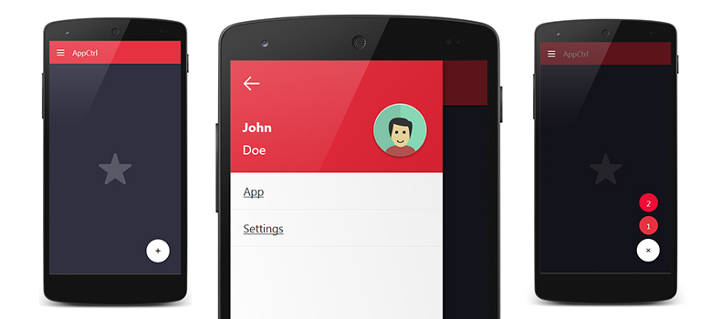

# Native-like Framework
Native-like **menu drawer**, **pull-to-sync**, **action button**, **in-app-toast** notification, **three-dot-menu** and **burger menu icon** implementation for angular mobile/desktop apps.

- using hammer.js for better touch support.
- fully animated **burger menu icon**
- nice and smooth **menu drawer** (slide from left)
- animated **pull-to-refresh** with callback
- **in-app-toast** messages with true/false callback
- **three-dot-menu** for secondary actions
- animated action button (optional: see [Configuration](#configuration))
- adjust content height (optional: see [Configuration](#configuration))
- ~13kB minified.

You can find [working example here](http://nlmd.vincurekf.cz).

## Content
  - [Why this?](#why-this)
  - [Getting started](#getting-started)
  - [nlFramework modules](#nlframework-modules)
    - [#nlDrawer](#nldrawer)
    - [#nlBurger](#nlburger)
    - [#nlRefresh](#nlrefresh)
    - [#nlMenu](#nlmenu)
    - [#nlToast](#nltoast)
  - [Additional stuff](#additional-stuff)
    - [nlContent](#nlcontent)
    - [#nlActionButton](#nlactionbutton)
  - [Objects](#objects)
    - [$nlConfig](#nlconfig)
    - [$nlFramework](#nlframework)
  - [Configuration](#configuration)
  - [Styles](#styles)
  - [Example code](#example-code)
  - [Example app](#example-app)
  - [Schmeckels](#schmeckels)
  - [Licence](#licence)

## Why this?
If you are developing application for android with Phonegap or Ionic or other alternative,
this is exactly for you. 
I've been struggling with menu implementations, found some but never got the feel and usability i wanted. No touch support or slow/no animations, if there was animations, they mostly have lags.

With **nlFramework** you have touch support, slide open/close/toggle menu, action button, pull-to-refresh, in app toast notfication, three-dot-menu and all with smooth hardware accelerated animations.

### Getting started
To start using **nlFramework** in your app include 
**hammer.js**, **ng-nlFramework-min.js** and **ng-nlFramework.css** in your project:
```html
<script src="hammer.js"></script>
<script src="ng-nlFramework-min.js"></script>
<link href="ng-nlFramework.css" rel="stylesheet">
```

## nlFramework modules
Lets take a look at all the modules that **nlFramework** 

### $nlDrawer
To make this module work, first you need to insert this HTML elements:   
**#nlDrawer**, **#nlSwipe**, **nlBurger** (see [$nlBurger](#$nlburger)), **#nlTopbar** and **#nlDimm**:
```html
<!-- body of the menu drawer -->
<div id="nlDrawer"></div>
<!-- stripe on the left of the screen to detect slide from side of the screen -->
<div id="nlSwipe"></div>
<!-- takes care of the overlay dimming -->
<div id="nlDimm"></div>
<!-- toggle icon for toggling menu -->
<div id="nlBurger">
  <div id="burger-top"></div>
  <div id="burger-center"></div>
  <div id="burger-bottom"></div>
</div>
<!-- main top bar -->
<div id="nlTopbar"></div>
```

then just initialize it:
```js
$nlDrawer.init();
```

And the work is done.   
Here is what the module contains:
```js
- **$nlDrawer**
 - ```init()```: initializes the drawer
 - ```show()```: shows the drawer (slide in)
 - ```hide()```: hides the drawer (slide out)
 - ```toggle()```: toggles the drawer (show/hide)
 - ```togglePlus()```: toggles the action button (ON/OFF)
 - ```openned```: returns true/false if the drawer is openned/closed
```


### $nlBurger
This simple module takes care of the burger menu icon animation.
```html
<!-- toggle icon for toggling menu -->
<div id="nlBurger">
  <div id="burger-top"></div>
  <div id="burger-center"></div>
  <div id="burger-bottom"></div>
</div>
```

Here is what **$nlBurger** can do:
```js
- **$nlBurger**
  - ```toggle(true)```: Toggles the burger ON - active
  - ```toggle(false)```: Toggles the burger OFF - inactive
```


### $nlRefresh
Pull-to-refresh module.  
Is hidden behind **#nlTopbar** and waits for pulling to show itself.  
For this module, you need to add this in your HTML **#nlRefresh**, 
and if you don't have already **nlTopbar** add it as well:
```html
<!-- pull-to-refresh indicator -->
<div id="nlRefresh">
  <svg version="1.1" id="reload-icon" xmlns="http://www.w3.org/2000/svg" xmlns:xlink="http://www.w3.org/1999/xlink" x="0px" y="0px" viewBox="0 0 342.5 342.5" style="enable-background:new 0 0 342.5 342.5;" xml:space="preserve">
  <path d="M254.37,22.255c-1.161-0.642-2.53-0.795-3.803-0.428c-1.274,0.367-2.35,1.226-2.992,2.387l-21.758,39.391
    c-1.335,2.417-0.458,5.459,1.96,6.794C264.616,90.748,287.5,129.495,287.5,171.52c0,63.649-51.782,115.431-115.431,115.431
    S56.638,235.169,56.638,171.52c0-23.888,7.557-47.427,21.382-66.897l34.478,34.478c1.338,1.337,3.315,1.806,5.109,1.21
    c1.795-0.596,3.101-2.152,3.374-4.024L139.963,6.271c0.228-1.563-0.295-3.141-1.412-4.258c-1.117-1.117-2.7-1.639-4.258-1.412
    L4.278,19.584c-1.872,0.273-3.428,1.579-4.023,3.374c-0.596,1.795-0.127,3.772,1.21,5.109l37.292,37.292
    C14.788,95.484,1.638,133,1.638,171.52c0,93.976,76.455,170.431,170.431,170.431c93.976,0,170.431-76.455,170.431-170.431
    C342.5,109.478,308.731,52.283,254.37,22.255z"/>
  </svg>
</div>
<!-- main top bar if you don't have it already -->
<div id="nlTopbar"></div>
```

and then initialize the module:
```js
$nlRefresh.init();
```

This will start the module and assign pull action to **nlTopbar**.   
To add custom callback assign some function to **$nlRefresh.callback()** which by default 
just prints something in the console. In order to properly stop the refreshing animation, 
you must call **nlRefresh.syncEnd()** at the end of your task otherwise the animation 
will go forever.
```js
$nlRefresh.callback = function(){
  // do something here and then call nlRefresh.syncEnd()
  $nlRefresh.syncEnd();
};
```

Here is what the module contains:
```js
- **$nlRefresh**
  - ```init()```: call in your app if you wish to use **pull-to-sync**
  - ```callback()```: your custom callback function
    - remeber to call ```syncEnd()``` at the end of your process to end the animation
  - ```syncEnd()```: as mentioned above, this ends the syncing animation
```


### $nlToast
Very simple toast notification which shows text that was passed to it.   
To make this work, add **nlToast** in your HTML:
```html
<!-- toast notification element -->
<div id="nlToast"></div>
```

and then initialize it:
```js
$nlToast.init();
```

now you can start using notifications.   
Set the options and bring the toast:
```js
var options = {
  text: 'I am shy!',
  timeout: 2500
}
$nlTaost.show( options )
```

Boom, toast!

Here is what **$nlToast** contains:
```js
- **$nlToast**
  - ```init()```: initialize the toast notifications
  - ```show(options)```: show notification
    - accepted options:
    - ```text``` can be any string
    - ```position``` display 'top' or 'bottom' toast (optional)
    - ```trueCallback``` can be any function (optional)
    - ```falseCallback``` can be any function (optional)
    - ```timeout```: number (miliseconds), if you don not set the timeout, notification stays until canceled by user (optional)
```

#### $nlMenu
three-dot-menu in the top right corner, this is very simple to use, just place your ul->li items with callback here and initialize - tadaa.

HTML for menu module:
```html
<!-- secondary three-dot-menu -->
<div id="nlMenu" class="main">
  <!-- do not remove this -->
  <div id="nlIcon">
    <div id="dot-top"></div>
    <div id="dot-center"></div>
    <div id="dot-bottom"></div>
  </div>
  <div id="nlMenuContent">
    <!-- place your menu content here -->
    <ul>
      <li ng-click="toast.show({title:'Selected Share',timeout: 2500})">Share</li>
      <li ng-click="toast.show({title:'Selected Edit',timeout: 2500})">Edit</li>
      <li ng-click="toast.show({title:'Thanks!',timeout: 1000})">Hug someone</li>
    </ul>
  </div>
</div>
```

initialize the menu and now you have ```show()``` and ```hide()``` functions availiable.   
```js
$nlMenu.init();
$nlMenu.show();
$nlMenu.hide();
```

And that is all what **$nlMenu** can do:
```js
- **$nlMenu**
  - ```init()```: initialize the secondary menu
  - ```show()```: shows the menu
  - ```hide()```: hides the menu
```


### Additional stuff
#### #nlContent
Is where you content belongs, this part is optional and not needed for **nlFramework** to work. If you are using it, you must add **#nlInner** to your content element (in this case I am rendering my content in ng-view so that element must have id **nlInner**), this just adds basic styles to make the content allways at least 100% height to fill up the space. (you can see [ng-nlFramework.css/scss](ng-nlFramework.scss), nothing fancy)
```html
<!-- view content - used as a wrapper -->
<div id="nlContent">
  <!-- your part of the code, views etc.. -->
  <div id="nlInner" ng-view=""></div>
</div>
```

#### #nlActionButton
action button with two sub actions which will show after the main (**#nlPlus**) button is clicked/tapped
```html
<!-- action button -->
<div id="nlActionButton" class="switch">
  <div class="action-button depth z1 option one" ng-click="drawer.togglePlus()">
      2
  </div>
  <div class="action-button depth z1 option two" ng-click="drawer.togglePlus()">
      1
  </div>
  <div id="nlPlus" class="action-button depth z1 plus" ng-click="drawer.togglePlus()">
    <span>
      +
    </span>
  </div>
</div>
```

### Objects

Apart from [$nlDrawer](#$nldrawer), [$nlBurger](#$nlburger), [$nlRefresh](#$nlrefresh), [$nlToast](#$nltoast) and [$nlMenu](#$nlmenu) 
there are also [$nlConfig](#$nlconfig) and core module with shortcuts to all other modules [$nlFramework](#$nlframework).   

### $nlConfig
You can set custom configuration of some modules and thier HTML elements. **$nlConfig** holds the configuration of all the modules. 

- **$nlConfig**: contains all options and variables of nlFramework
  - ```options```: contains drawer and burger options (see [Configuration](#configuration))
    - ```burger```: burger options only
    - ```refresh```: pull-to-refresh options

### Configuration
You can use **$nlFramework** function ```set()``` to set options.

```js
var options = {
  // the maximum width that can drawer take, can be any number value (pixels)
  maxWidth: 300, 
  // define the height of your topbar, you must set this if you'll use modifyViewContent
  topBarHeight: 56, 
  // Speed of the drawer movement, defined in seconds (0.2, 1, 5...)
  speed: 0.2, 
  // css transition style property, 
  // could be **linear**, **ease**, **ease-in**, **ease-out**, **ease-in-out**
  animation: 'ease', 
  // if you are using ionic view or angular ng-view this comes handy as it adds margin to your content 
  // and changes the size of it (when you rotate device etc.)
  modifyViewContent: true, 
  // wheter or not you are using action buttons provided with Native-like Drawer
  useActionButton: true, 
  burger: { // you can adjust the burger look a bit
    startScale: 1, // X scale of bottom and top line of burger menu at starting point (OFF state)
    endScale: 0.7 // X scale of bottom and top line of burger menu at end point (ON state)
  },
  refresh: {
    defaultColor: '#aa3344', // default(inactive) color
    activeColor: '#558844' // active color
  }
};
$nlFramework.set( options );
```

#### $nlFramework
You can use the parts separately or use this one module  which shortcuts to all other modules:

- **$nlFramework**
  - ```drawer()```: shortcut to [$nlDrawer](#$nldrawer)**
  - ```burger()```: shortcut to **$nlBurger**
  - ```refresh()```: shortcut to **$nlRefresh**
  - ```toast()```: shortcut to **$nlToast**
  - ```menu()```: shortcut to **$nlMenu**
  - ```config```: shortcut to **$nlConfig**
  - ```set()```: set **nlFramework** options (see [Configuration](#configuration))


### Styles
There is **ng-nativeDrawer.scss** file with default styles and colors which are there for you prepared to customize the look of nlFramework parts however you like.

### Example code
Here is example of all modules in one file.   
In your main javascript file where you start your angular app 
you need to initialize the modules:

```js
// load nlFramework in your app
var exampleApp = angular.module('exampleApp', ['ionic', 'nlFramework']);

// include all parts of nlFramework
exampleApp.run(function($rootScope, $ionicPlatform, $nlDrawer, $nlBurger, $nlRefresh, $nlConfig, $nlToast, $nlMenu) {

/* Or include just core module and then use parts
exampleApp.run(function($rootScope, $ionicPlatform, $nlFramework)
$rootScope.fw = $nlFramework;
$rootScope.drawer = $nlFramework.drawer;
$rootScope.refresh = $nlFramework.refresh;
$rootScope.burger = $nlFramework.burger;
$rootScope.config = $nlFramework.config;
$rootScope.toast = $nlFramework.toast;
$rootScope.menu = $nlFramework.menu;
*/

  $ionicPlatform.ready(function() {

    /* ---------------------------
     * Drawer:
     * set options and initialize
     */ 
    var options = {
      maxWidth: 300,
      speed: 0.2,
      animation: 'ease',
      topBarHeight: 56,
      modifyViewContent: true,
      useActionButton: true
    }
    $nlDrawer.init( options );
    
    // show drawer
    $nlDrawer.show();
    // hide drawer
    $nlDrawer.hide();
    
    // toggle burger OFF
    $nlBurger.toggle();
    // toggle burger ON
    $nlBurger.toggle( true );

    // set new options with nlFramework's set()
    $nlFramework.set({
      speed: 0.6,
      maxWidth: 250,
      animation: 'ease-out'
    });

    // initialize pull-to-refresh
    $nlRefresh.init();
    // set custom callback
    // DO NOT FORGET to call $nlRefresh.syncEnd(); after finish!
    $nlRefresh.callback = function(){
      // here is just timeout to wait 5sec before ending sync animation
      setTimeout( function(){
        console.log( 'custom callback onSync' );
        // after doing some stuff end syncing animation
        $nlRefresh.syncEnd();
      }, 5000 );
    };
    //

    // initialize three-dot-menu
    $nlMenu.init();

    // initialize in app toast message
    $nlToast.init();
    // false callbach function
    $rootScope.toastOk = function(){
      console.log('Custom CB TRUE');
    }
    // false callbach function
    $rootScope.toastFalse = function(){
      console.log('Custom CB False');
    }
    // show the toast!
    $nlToast.show(
      'A am a Toast! Yum!', // notification text 
      'top', // position, top or default bottom (optional)
      $rootScope.toastOk, // on swipe right (optional)
      $rootScope.toastFalse, // on swipe left (optional)
      2500 // timeout (optional)
    );

    // If you like you can register backbutton handle --------
    $ionicPlatform.registerBackButtonAction(function () {
      if ( !$nlDrawer.openned ) {
        // thedrawer is closed - exit the app
        navigator.app.exitApp();
      } else {
        // thedrawer is openned - close
        $nlDrawer.hide();
      }
    }, 100);
    // -------------------------------------------------------

  });
});
```
## Example app
There is example app alongside with its source code, so feel free to check it and play with it :)
I hope this will help you.

## Schmeckels
If You feel fancy You can donate me some [schmeckels](https://www.youtube.com/watch?v=-D_422Z3rUE)!
```
Bitcoin: 35VFPig1euHDiiGhG4LpSqAAev5FKqU3MN
```

## Licence
Released under [MIT Licence](http://choosealicense.com/licenses/mit/)

Copyright © 2015 Filip Vincůrek
